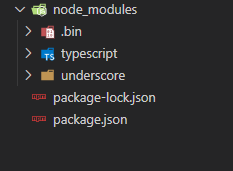
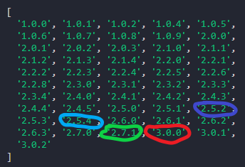
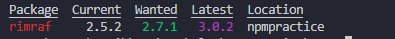

# Npm (Node Package Manager) Özet Bilgiler

Merhabalar arkadaşlar. Özet bilgilerle pratik bir npm makalesi hazırladım. Umarım beğenirsiniz.Yazıda Vs Code kullandım. Siz de favori kod editörünüzü kullanabilirsiniz. Bu yazı için bilgisayarınızda Node.js'in kurulu olması gerekmektedir. 

Vs code’da terminale **md NpmPractice** yazıp NpmPractice klasörü oluşturarak başlıyoruz. File→Open Folder menüsünden NpmPractice klasörü seçilir. Bu klasör altında çalışacağız.

1- Terminalde (Ctrl+" kısayolu) **npm init --yes** komutu çalıştırılarak package.json dosyası aşağıdaki şekilde otomatik olarak oluşturulur:

```json
{
 "name": "NpmPractice",
 "version": "1.0.0",
 "description": "",
 "main": "index.js",
 "scripts": {"test": "echo \"Error: no test specified\" && exit 1"},
 "keywords": [],
 "author": "",
 "license": "ISC"
}
```
Ctrl+Shift+E kısayolu ile ulaşabileceğimiz explorerdan package.json dosyasını açın. Package.json dosyasını incelemeye başlayabiliriz.

2- "name" alanı hep küçük harften, boşluksuz tek kelime fakat "-" veya "_" karakterlerine izin verecek şekilde oluşturulabilir. Bu durumda name alanı aşağıdaki gibi tanımlanabilir: 

```json
{
 "name": "npmpractice",
 ...
}
```
3- "version" alanına 1.3.7 ataması yapalım. Uygulamalarımızda versiyon ayarlaması şöyle olabilir. Örneğin uygulamaya yeni bir özellik eklemeden sadece bir hatayı düzelttiysek 1.3.8 şeklinde sürümü ayarlayabiliriz. Eğer yeni bir işlev kazandırdıysak ortadaki sayıyı bir artırarak uygulamanın sürümünü 1.4.0 şeklinde ayarlayabiliriz. Eğer uygulama geriye uyumluluğunu kaybettiyse yani ciddi bir değişim söz konusu ise sürüm 2.0.0 şeklinde bir üst sürüm numarası olmalı.
 ```json
{
 "name": "npmpractice",
 "version": "1.3.7",
 ...
}
```
4- "description" alanına projeye uygun kısa bir tanımlama girilebilir:

 ```json
{
 "name": "npmpractice",
 "version": "1.3.7",
 "description": "Small project for npm practice",
 ...
}
```
5- Terminalden **npm init --yes** komutu ile package.json dosyası oluşturulduğunu biliyoruz. Fakat bu komut ile **dependencies** (uygulamanın çalışması için gerekli olan paketler) ve **devDependencies** (sadece uygulamayı geliştirdiğimiz ortamda kullanılan üretim ortamına aktarılmayan paketler) alanları oluşmayacağından biraz sonra oluşturacağız. Öncelikle uygulamanın çalışması için bağımlı olduğu farazi bir paket kuralım. Terminalden **npm install underscore --save** komutunu çalıştıralım.
```json
{
  "name": "npmpractice",
  "version": "1.3.7",
  "description": "Small project for npm practice",
  "main": "index.js",
  "scripts": {
    "test": "echo \"Error: no test specified\" && exit 1"
  },
  "keywords": [],
  "author": "",
  "license": "ISC",
  "dependencies": {
    "underscore": "^1.12.0"
  }
}
```
6- Sırada sadece uygulamayı geliştirirken ihtiyaç duyduğumuz uygulama geliştirme konforumuzu arttıran fakat uygulamanın kendisi için gerekli olmayan bir paket kurma var. Terminalden **npm install typescript --save-dev** komutunu çalıştırıyoruz.

```json
{
  "name": "npmpractice",
  "version": "1.3.7",
  "description": "Small project for npm practice",
  "main": "index.js",
  "scripts": {
    "test": "echo \"Error: no test specified\" && exit 1"
  },
  "keywords": [],
  "author": "",
  "license": "ISC",
  "dependencies": {
    "underscore": "^1.12.0"
  },
  "devDependencies": {
    "typescript": "^4.1.5"
  }
}
```
Dikkat ederseniz yazdığımız her iki komutta da **--save** parametresi kullandık. Save parametresi ile projeye eklediğimiz paketlerin package.json dosyasında listelenmesini sağlıyoruz. Ayrıca npm install komutlarından sonra projenin dosya yapısının değiştiğini gözlemleyebilirsiniz:



npm install komutu ile kurduğumuz her paket Node.js platformunun efsane klasörü **node_modules** altına kurulur.

7- Package.json dosyanızı arkadaşlarınızla paylaşabilirsiniz. Fakat arkadaşınızda henüz bu iki paket kurulu değil. Tek tek kurması mı gerekecek? Hayır. Tek yapması gereken terminalden **npm install** komutunu çalıştırmak.

8- Şimdi concurrently ve rimraf adındaki paketleri **npm install concurrently --save** ve **npm install rimraf --save-dev** komutları ile kuralım.
```json
{
 ...
  "dependencies": {
    "concurrently": "^5.3.0",
    "underscore": "^1.12.0"
  },
  "devDependencies": {
    "rimraf": "^3.0.2",
    "typescript": "^4.1.3"
  }
}
```
Rimrafı **npm uninstall rimraf --save-dev** komutu ile projeden kaldıralım. Yine rimrafın özel bir sürümünü **npm install rimraf@2.5.2 --save-dev** komutu ile kuralım.
 ```json
 {
  ...
  "dependencies": {
    "concurrently": "^5.3.0",
    "underscore": "^1.12.0"
  },
  "devDependencies": {
    "rimraf": "^2.5.2",
    "typescript": "^4.1.3"
  }
}
 ```
 9- Bir pakete ait (mesela rimraf) tüm bilgileri görmek için **npm view rimraf** komutu çalıştırılır. Sadece daha önce yayınlanmış versiyon bilgilerini görmek içinse **npm view rimraf versions** komutu kullanılabilir.
 

 10- Bir paketin daha güncel sürümü var mı öğrenmek için **npm outdated** komutu çalıştırılır.


 
 Current sütunu kurulu paket sürümünü, Latest sütunu paketin kullanıma hazır (beta olmayan) en son sürümünü, Wanted sütunu ise package.json’da kullanılan **^** veya **~** tanımlamalarına karşılık gelen maksimum sürüm numarasını gösterir. 

11- Dependencies kısmındaki sürüm numarasından önce gelen **^** sembolüne değinmeliyiz. npm install komutunu çalıştırdığınızda package.json dosyasında yer alan rimraf paketinin 2.5.2 sürümü kurulur. **^** ifadesi ile bu paketin 3.0.0 sürümünden bir önceki sürüm olan 2.7.1 sürümüne güncellenebilme potansiyeli var demektir. **npm update** komutu çalıştırıldığında: 

 ```json
 {
  ...
  "dependencies": {
    "concurrently": "^5.3.0",
    "underscore": "^1.12.0"
  },
  "devDependencies": {
    "rimraf": "^2.7.1",
    "typescript": "^4.1.3"
  }
}
 ```
diğer paketler zaten güncel olduğundan sadece rimraf upgrade edilebileceği en yüksek sürüm olan 2.7.1 sürümüne güncellenecektir.

12- Bir başka kullanılan sembol ise **~** sembolü. **~** sembolü daha kısıtlayıcı bir sembol. Yukarıdaki örnekten devam edersek package.json'da **"rimraf":"~2.5.2"** şeklinde bir tanımlama olsaydı bu durumda **npm update** komutu çalıştırıldığında rimraf 2.6.0'a en yakın olan 2.5.4 sürümüne güncellenecekti.

13- Tüm paketler yerine tek bir paketi güncellemek için **npm update packageName --save(-dev)** komutu çalıştırılır. **npm update rimraf --save-dev** gibi.
 
14- Projenizde eğer bir hata yaptıysanız ve en baştan başlamak istiyorsanız **node_modules** klasörünü ve package-lock.json dosyasını silin. package.json dosyasında rimrafın sürümünü **"rimraf":"^2.5.1"** olarak değiştirip package.json dosyasını kaydedin. Şimdi **npm install** komutunu çalıştırın. 
 
15- Eğer rimrafın versiyonunun npm install komutu ile daha yeni bir sürüme güncellenmesini istemiyorsak **npm install rimraf --save-dev --save-exact komutunu çalıştırabilir veya direkt package.json dosyasında rimraf sürüm numarasının önündeki ^ işaretini kaldırıp package.json dosyasını kaydettikten sonra npm install komutunu çalıştırabiliriz. Yani oluşturduğumuz package.json’ı kullanan başka birinin sadece exact ile kurulan sürümü kullanacağını garanti ederiz.
 
16- **npm help** komutu ile tüm npm komutlarını görebilirsin.
 
17- **npm bugs react-native** yazarak react-native github projesinin tüm buglarını tarayıcıda görebilirsiniz. **npm docs typescript** komutu ile belirtilen paketin eğer mevcut ise dokümantasyon sayfasını tarayıcıda açabiliriz.
 
18- Hem npm install hem de npm uninstall komutlarını çalıştırırken --save eki ile çalıştırılmalı. Eğer paket devDependencies kısmında ise --save-dev eki ile çalıştırılmalı.
 
19- **npm dedupe** komutu ile node_modules klasörü altındaki dosya yapısı optimize edilir. Yine **npm prune** komutu ile projemizde hiç kullanılmayan paketler projeden temizlenir.
 
20- **npm ls** komutu ile kurulu tüm paketleri listeleyebiliriz. **npm ls -depth=0** komutu ile sadece en üst hiyerarşideki paketleri (alt paketlerini değil) listeleriz.

 Başka bir yazıda görüşmek üzere hepinize güzel günler.