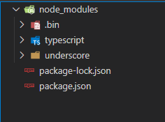
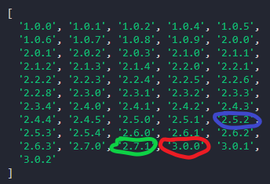

Merhabalar arkadaşlar. Özet bilgilerle pratik bir npm makalesi hazırladım. Umarım beğenirsiniz.

Vs code’da terminale "md NpmPractice" yazılarak NpmPractice klasörü oluşturulur. Sonra File→Open Folder menüsünden NpmPractice klasörü seçilir.


1. Terminalde (Ctrl+" kısayolu) npm init --yes komutu çalıştırılarak package.json dosyası aşağıdaki şekilde otomatik olarak oluşturulur:

```json
{
 "name": "NpmPractice",
 "version": "1.0.0",
 "description": "",
 "main": "index.js",
 "scripts": {"test": "echo \"Error: no test specified\" && exit 1"},
 "keywords": [],
 "author": "",
 "license": "ISC"
}
```
Ctrl+Shift+E kısayolu ile ulaşabileceğimiz explorerdan package.json dosyasını açın. Package.json dosyasını incelemeye başlayabiliriz.

2. "name" alanı hep küçük harften, boşluksuz tek kelime fakat "-" veya "_" karakterlerine izin verecek şekilde oluşturulabilir. Bu durumda name alanı aşağıdaki gibi tanımlanabilir: 

```json
{
 "name": "npmpractice",
 ...
}
```
3. "version" alanı 1.4.5 şeklinde olmalı. Uygulamalarımızda versiyon ayarlaması şöyle olabilir. Örneğin uygulamaya yeni özellik eklemeden sadece bir hatayı düzelttiysek 1.4.6 şeklinde sürümü ayarlayabiliriz. Eğer yeni bir işlev kazandırdıysak uygulamanın sürümünü 1.5.0 şeklinde ayarlayabiliriz. Eğer uygulama geriye uyumluluğunu kaybettiyse yani ciddi bir değişim söz konusu ise sürüm 2.0.0 şeklinde bir üst sürüm numarası olmalı.

 ```json
{
 "name": "npmpractice",
 "version": "1.0.0",
 ...
}
```
4. "description" alanına projeye uygun kısa bir tanımlama girilebilir:

 ```json
{
 "name": "npmpractice",
 "version": "1.0.0",
 "description": "Small project for npm practice",
 ...
}
```
5. Terminalden npm init --yes komutu ile package.json dosyası oluşturulduğunu biliyoruz. Fakat bu komut ile dependencies (uygulamanın çalışması için gerekli olan paketler) ve devDependencies (sadece uygulamayı geliştirdiğimiz ortamda kullanılan üretim ortamına aktarılmayan paketler) alanları oluşmayacağından biraz sonra oluşturacağız. Öncelikle uygulamanın çalışması için bağımlı olduğu farazi bir paket kuralım. Terminalden **npm install underscore --save** komutunu çalıştıralım.
```json
{
  "name": "npmpractice",
  "version": "1.0.0",
  "description": "Small project for npm practice",
  "main": "index.js",
  "scripts": {
    "test": "echo \"Error: no test specified\" && exit 1"
  },
  "keywords": [],
  "author": "",
  "license": "ISC",
  "dependencies": {
    "underscore": "^1.12.0"
  }
}
```
6. Sırada sadece uygulamayı geliştirirken ihtiyaç duyduğumuz uygulama geliştirme konforumuzu arttıran fakat uygulamanın kendisi için gerekli olmayan bir paket kurma var. Terminalden **npm install typescript --save-dev** komutunu çalıştırıyoruz.

```json
{
  "name": "npmpractice",
  "version": "1.0.0",
  "description": "Small project for npm practice",
  "main": "index.js",
  "scripts": {
    "test": "echo \"Error: no test specified\" && exit 1"
  },
  "keywords": [],
  "author": "",
  "license": "ISC",
  "dependencies": {
    "underscore": "^1.12.0"
  },
  "devDependencies": {
    "typescript": "^4.1.3"
  }
}
```
Dikkat ederseniz yazdığımız her iki komutta da --save parametresi kullandık. Save parametresi ile projeye eklediğimiz paketlerin package.json dosyasında listelenmesini sağlıyoruz. Ayrıca npm install komutlarından sonra projenin dosya yapısının değiştiğini gözlemleyebilirsiniz:



npm install komutu ile kurduğumuz her paket node_modules klasörü altına kurulur.

7. Package.json dosyanızı arkadaşlarınızla paylaşabilirsiniz. Fakat arkadaşınızda henüz bu iki paket kurulu değil. Tek tek kurması mı gerekecek? Hayır. Tek yapması gereken terminalden npm install komutunu çalıştırmak.

8. Dependencies kısmındaki sürüm numarasından önce gelen ^ sembolüne değinmeliyiz. Arkadaşınız npm install komutunu çalıştırdığında örneğin package.json dosyasında typescript paketinin versiyonu 4.1.3 olmasına rağmen hali hazırda var olan en üst sürümünü (5.0.0 a kadar) kuracağı anlamına geliyor.

9. Bir başka kullanılan sembol ise ~ sembolü. ~ sembolü daha kısıtlayıcı bir sembol. Yukarıdaki örnekten devam edersek arkadaşınız en fazla 4.2.0 sürümüne en yakın sürüm numaralı paketi kurabilir anlamına geliyor.

10. Şimdi concurrently ve rimraf adındaki paketleri **npm install concurrently --save** ve **npm install rimraf --save-dev** komutları ile kuralım.
```json
{
 ...
  "dependencies": {
    "concurrently": "^5.3.0",
    "underscore": "^1.12.0"
  },
  "devDependencies": {
    "rimraf": "^3.0.2",
    "typescript": "^4.1.3"
  }
}
```
Rimrafı projeden kaldırmak için **npm uninstall rimraf --save-dev** komutunu kullanabiliriz. Yine rimrafın özel bir sürümünü kurmak istiyorsak **npm install rimraf@2.5.2 --save-dev** komutunu çalıştırmalıyız.

 ```json
 {
  ...
  "dependencies": {
    "concurrently": "^5.3.0",
    "underscore": "^1.12.0"
  },
  "devDependencies": {
    "rimraf": "^2.5.2",
    "typescript": "^4.1.3"
  }
}
 ```
 11. Bir pakete ait (mesela rimraf) tüm bilgileri görmek için **npm view rimraf** komutu çalıştırılır. Sadece daha önce yayınlanmış versiyon bilgilerini görmek içinse **npm view rimraf versions** komutu kullanılabilir.

 

 12. Bir paketin daha güncel sürümü var mı öğrenmek için **npm outdated** komutu çalıştırılır.
 


 Current sütunu kurulu paket sürümünü, Latest sütunu paketin kullanıma hazır (beta olmayan) en son sürümünü, Wanted sütunu ise package.json’da kullanılan ^ veya ~ tanımlamalarına karşılık gelen maksimum sürüm numarasını gösterir. 

 13. Paket güncellemek için **npm update packageName --save(-dev)** komutu çalıştırılır. **npm update rimraf --save-dev** Görüleceği üzere rimraf’ın sürümü yeniden an itibariyle en güncel olan 3.0.2 oldu.
 
 14. **npm install rimraf@2.5.1 --save-dev** komutu ile rimrafın sürümünü tekrar 2.5.1'e çekelim. Eğer bu sürümün npm install komutu ile daha yeni bir sürüme güncellenmesini istemiyorsak **npm install rimraf --save-dev --save-exact komutunu çalıştırabiliriz. Package.json dosyasından da görüleceği üzere rimraf sürüm numarasının önündeki ^ işareti kalktı. Yani oluşturduğumuz package.json’ı kullanan başka birinin sadece exact ile kurulan sürümü kullanacağını garanti ederiz.
 
 15. **npm help** komutu ile tüm npm komutlarını görebilirsin.
 
 16. **npm bugs react-native** yazarak react-native github projesinin tüm buglarını tarayıcıda görebilirsiniz. **npm docs typescript** komutu ile belirtilen paketin eğer mevcut ise dokümantasyon sayfasını tarayıcıda açabiliriz.
 
 17. Hem npm install hem de npm uninstall komutu çalıştırırken --save eki ile çalıştırılmalı. Eğer paket devDependencies kısmında ise --save-dev eki ile çalıştırılmalı.
 
 18. npm dedupe komutu ile node_modules klasörü altındaki dosya yapısı optimize edilir. Yine npm prune komutu ile projemizde hiç kullanılmayan paketler projeden temizlenebilir.
 
 19. npm ls komutu ile kurulu tüm paketleri listeleyebiliriz. npm ls -depth=0 komutu ile sadece en üst hiyerarşideki paketleri (alt paketlerini değil) listeleriz.

 Başka bir yazıda görüşmek üzere hepinize güzel günler.